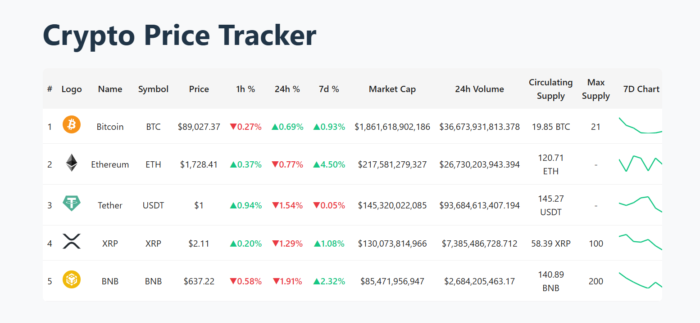

# Real-Time Crypto Price Tracker

A responsive React + Redux Toolkit app that tracks real-time crypto prices (like CoinMarketCap), simulating WebSocket updates and managing all state via Redux. All crypto logos are local SVGs for reliability and speed.

## 🚀 Features

- Real-time price, % change, and volume updates (simulated)
- Responsive, modern table UI (centered, white background)
- Local SVG logos for all coins (no CORS issues)
- Color-coded % changes (green/red)
- 7D mini-chart SVGs
- Built with React, Redux Toolkit, Vite, and Styled Components

## 🖼️ Screenshot



## 🛠️ Tech Stack

- React + Vite + TypeScript
- Redux Toolkit (createSlice, configureStore)
- Styled Components

## 📦 Setup Instructions

1. Clone the repo:
   ```bash
   git clone <your-repo-url>
   cd <project-folder>
   ```
2. Install dependencies:
   ```bash
   npm install
   ```
3. Start the dev server:
   ```bash
   npm run dev
   ```
4. Open [https://xiv-tech-assignment-eight.vercel.app/] in your browser.

## 📁 Project Structure

- `src/assets/` — All crypto SVG logos
- `src/cryptoSlice.ts` — Redux slice with all asset data
- `src/CryptoTable.tsx` — Main table UI
- `src/App.tsx` — App entry, real-time simulation logic

## 📹 Demo

Add a GIF or video here showing the UI and live updates.

---
